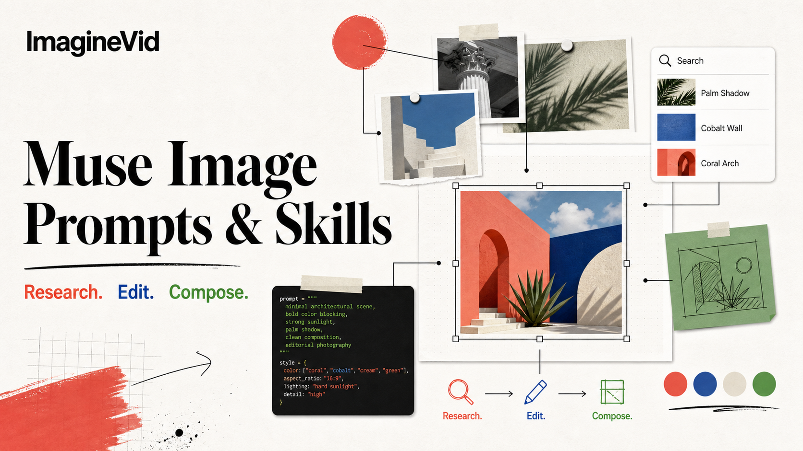

<a href="https://github.com/imagineVid/Awesome-muse-image-prompts-and-skills">
  
</a>

> ImagineVid のワークフローで、プロンプト設計を制作に使えるビジュアルへ変換します。
# Awesome Muse Image プロンプト＆スキル

[](https://github.com/sindresorhus/awesome)
[](https://github.com/imagineVid/Awesome-muse-image-prompts-and-skills)
[](https://creativecommons.org/licenses/by/4.0/)
[](https://github.com/imagineVid/Awesome-muse-image-prompts-and-skills/actions)
[](docs/CONTRIBUTING.md)

> ImagineVid が厳選した Muse Image プロンプト、再利用できるプロンプトスキル、ビジュアル事例集

> **出典と削除について：** 各プロンプトは公開元と作者へリンクしています。権利は各権利者に帰属します。訂正や削除をご希望の場合は issue でお知らせください。

---

[](README.md) [](README_zh.md) [](README_ja-JP.md) [](README_ko-KR.md) [](README_es-ES.md) [](README_de-DE.md) [](README_fr-FR.md) [](README_it-IT.md) [](README_pt-PT.md) [](README_tr-TR.md)
[](README_ar-SA.md) [](README_ru-RU.md) [](README_nl-NL.md) [](README_pl-PL.md)

---

## キュレーションを見る

**[Muse Image プロンプト集を開く](https://imaginevid.io/ja/ai-image-generator)**

このコレクションを使う理由

各事例は原典と作者表記を保持します。制作リンクは ImagineVid、機能説明は Meta の一次資料に基づきます。

| 機能 | GitHub README | ImagineVid コレクション |
|---------|--------------|---------------------|
| ビジュアル構成 | リスト表示 | 厳選ビジュアルセクション |
| 検索 | Ctrl+F のみ | 構造化カテゴリ |
| プロンプトワークフロー | - | 再利用できるプロンプトスキル |
| モバイル | 基本対応 | 各 README 言語で読みやすい構成 |
| カテゴリ | - | カテゴリ閲覧 |


### カテゴリ別に見る

- [**エージェント検索と事実ベースのビジュアル**](#workflow-agentic-research-factual-visuals) - 最新情報、計算、コード生成の構造を画像に取り込むリサーチ型プロンプト。
- [**精密編集とシーン保持**](#workflow-precision-editing-scene-preservation) - 構図、照明、同一性、対象外の細部を守りながら指定箇所だけを変更する編集。
- [**複数参照合成と同一性**](#workflow-multi-reference-composition-identity) - 複数の参照を合成しつつ、人物、製品、衣装、視覚システムの同一性を保つワークフロー。
- [**タイポグラフィ、ポスター、構造化レイアウト**](#workflow-typography-posters-structured-layouts) - 読みやすい文字、階層、余白、再利用できるレイアウト規則が重要なデザイン。
- [**連続アートとソーシャル形式**](#workflow-sequential-art-social-formats) - フレーム間の連続性が必要なカルーセル、コマ、物語シーケンス、SNS形式。
- [**ポートレート、質感、アートディレクション**](#workflow-portraits-texture-art-direction) - 人物の同一性、素材感、照明、意図的な画面言語を重視する肖像・アートディレクション。

---

## 目次

- [キュレーションを見る](#キュレーションを見る)
- [Muse Image とは？](#muse-image-とは)
- [公式機能事例](#official-capability-cases)
- [統計](#統計)
- [Community · 注目プロンプト](#community-featured-prompts)
- [Community · すべてのプロンプト](#community-prompt-cases)
- [貢献方法](#貢献方法)
- [ライセンス](#ライセンス)
- [謝辞](#謝辞)
- [スター履歴](#スター履歴)

---

## Muse Image とは？

**Muse Image** は、Meta が2026年7月に発表したエージェント型の画像生成・編集モデルです。検索やコードのツールを使い、推論時の計算量を増やして結果を検査・改善し、複数の参照画像を合成しながら、シーンの他の部分を保った局所編集を行えます。Meta AI などで段階的に提供されており、利用範囲は製品と地域によって異なります。

本コレクションは公式の機能デモとコミュニティのプロンプト事例を分け、各事例に公開元、作者、結果メディア、プロンプトの抽出・整理方法を残します。

- **ネイティブなマルチモーダル入力** - 文章の指示と1枚以上の参照画像を同じリクエストで組み合わせられます
- **生成と編集** - 新規生成、参照画像のスタイル変更、自然言語による局所的な修正に対応します
- **結果をモデル自身に検証させる** - エージェント型ツール利用と自己改善により、事実性、レイアウト、細部を高めます
- **対話による調整** - 要件を最初から書き直さず、構図、被写体、光、スタイルを継続的に調整できます
- **画面全体を作り直さずに編集** - 構図、同一性、照明、対象外の要素を保ちながら局所だけを変更します
- **利用可否は製品ごとに確認** - Muse Image は段階的提供中であり、本リポジトリは公開開発者APIの存在を示すものではありません

**調査ソース：** [Meta AI engineering overview](https://ai.meta.com/blog/introducing-muse-image-muse-video-msl/) · [Meta product announcement](https://about.fb.com/news/2026/07/introducing-muse-image-meta-ai/) · [Create images on ImagineVid](https://imaginevid.io/ja/ai-image-generator)

### プロンプト変数を再利用する

一部の出典プロンプトには `[BRAND]`、`[OBJECT]`、`[NAME]` などの変数があります。値だけを差し替え、検証済みの構図や照明設計は維持してください。

**例：**
```
`[BRAND]` を自分のブランド名に、または `[OBJECT]` を対象物に置き換え、その他の視覚指示は変更しません。
```

変数を使えば、出典のあるプロンプトを毎回書き直さずに安定して再利用できます。

---

<a id="official-capability-cases"></a>

## 公式機能事例

> Metaの一次公開事例です。編集見出しは翻訳し、公式プロンプトは検証用に英語のまま保持します。

<a id="official-agentic-tools"></a>

### Official Agentic Tool-Use Cases

Meta's launch examples showing Muse Image using code, search, and self-refinement before generating the final visual.

<a id="official-case-1"></a>

#### 事例 1: Scannable conference QR code in a manhwa scene


**公式ソースプロンプト（英語）:**

```
Create a 3:2 Korean manhwa-style conference scene with a young woman checking her phone beside an ICML 2025 poster. Generate and verify a scannable QR code for https://meta.ai, place it naturally on the poster, and keep the code readable after composition.
```

---

<a id="official-case-2"></a>

#### 事例 2: Swiss poster with coded Julia and Sierpinski fractals


**公式ソースプロンプト（英語）:**

```
Code a Julia set and an IFS Sierpinski triangle, render both accurately, then arrange them as a mid-century Swiss poster on warm off-white. Use an asymmetrical grid, generous white space, red, blue, and black geometric accents, and clean left-aligned labels.
```

---

<a id="official-case-3"></a>

#### 事例 3: Search-grounded moon-formation infographic


**公式ソースプロンプト（英語）:**

```
Research reputable sources on the giant-impact hypothesis, then create a vertical six-stage infographic covering proto-Earth, Theia, collision, debris disk, Moon formation, and present-day evidence. Use accurate labels, coherent cinematic space visuals, and concise evidence and counterpoint boxes.
```

---

<a id="official-case-4"></a>

#### 事例 4: Marketplace-grounded bedroom redesign


**公式ソースプロンプト（英語）:**

```
Using the uploaded bedroom and San Francisco location, redesign the room with warm, simple vintage pieces found through current Facebook Marketplace searches. Preserve the architecture and camera view; integrate a wood nightstand, dresser, rug, lamp, rattan chair, and autumn landscape art with realistic scale, light, and contact shadows.
```

---

<a id="official-precision-editing"></a>

### Official Precision Editing Cases

Short natural-language edits published by Meta, paired with the resulting Muse Image media.

<a id="official-case-5"></a>

#### 事例 5: Historical photo restoration

<table>
<tr>
<td width="50%" valign="top">

**Before:**


</td>
<td width="50%" valign="top">

**After:**


</td>
</tr>
</table>

**公式ソースプロンプト（英語）:**

```
Restore this image.
```

---

<a id="official-case-6"></a>

#### 事例 6: Fog removal with valley reveal

<table>
<tr>
<td width="50%" valign="top">

**Before:**


</td>
<td width="50%" valign="top">

**After:**


</td>
</tr>
</table>

**公式ソースプロンプト（英語）:**

```
Edit this to clear up the fog and reveal the beautiful valley below.
```

---

<a id="official-case-7"></a>

#### 事例 7: Rainbow-gradient flower edit

<table>
<tr>
<td width="50%" valign="top">

**Before:**


</td>
<td width="50%" valign="top">

**After:**


</td>
</tr>
</table>

**公式ソースプロンプト（英語）:**

```
Change the flower so the petals form a rainbow gradient.
```

---

<a id="official-case-8"></a>

#### 事例 8: Exact parking-sign text replacement

<table>
<tr>
<td width="50%" valign="top">

**Before:**


</td>
<td width="50%" valign="top">

**After:**


</td>
</tr>
</table>

**公式ソースプロンプト（英語）:**

```
Change this image to be '$3.00 ALL DAY', change the 'NO FREE PARKING' text to 'FREE PARKING ON WEEKENDS', and change the phone number to 555-5555.
```

---

<a id="official-case-9"></a>

#### 事例 9: Context-preserving zoom-out

<table>
<tr>
<td width="50%" valign="top">

**Before:**


</td>
<td width="50%" valign="top">

**After:**


</td>
</tr>
</table>

**公式ソースプロンプト（英語）:**

```
Zoom out slightly to show the chaos the dog has seen, giving context to its sheepish look.
```

---

<a id="official-multi-turn-composition"></a>

### Official Multi-Turn Composition Case

A scene carried across multiple edits while identity, environment, and an embedded reference remain coherent.

<a id="official-case-10"></a>

#### 事例 10: Cat-and-dog picnic becomes a complete cafe identity

<table>
<tr>
<td width="33%" valign="top">

**Picnic:**


</td>
<td width="33%" valign="top">

**Interior:**


</td>
<td width="33%" valign="top">

**Exterior:**


</td>
</tr>
</table>

**公式ソースプロンプト（英語）:**

```
Make an image of the referenced cat and dog as best friends having a picnic on a sunny day in vintage 35mm style. Then place that exact picnic image in a frame on a cozy cafe wall, and finally show the cafe exterior while keeping the framed photo visible through the window.
```

---

## 統計

<div align="center">

| 項目 | 数 |
|--------|-------|
| プロンプト総数 | **7** |
| 注目 | **3** |
| 最終更新 | **2026年7月21日火曜日 13:28:21 UTC** |

</div>

---

<a id="community-featured-prompts"></a>

## Community · 注目プロンプト

> 再利用性、視認性、表現の幅を基準に厳選

<a id="prompt-1"></a>

### No. 1: リアルタイム市場価格の報道写真


#### 説明

最新の地域価格を調べ、読みやすい値札として市場の報道写真に反映するワークフローです。

#### 原文プロンプト（英語）

```
Create an ultra-realistic news photograph from Türkiye. Show a greengrocer standing behind a market stall filled with different fruits. Every fruit must have a clearly readable label with its Turkish name and price. Research current average fruit prices in Türkiye and use plausible up-to-date values. Keep the scene observational rather than staged: natural daylight, documentary framing, realistic skin and produce texture, accurate Turkish typography, and no invented brands.
```

#### 出典画像

<table>
<tr>
<td width="100%" valign="top" align="center"></td>
</tr>
</table>

#### 詳細

- **作者:** [Ozan Sihay](https://x.com/ozansihay)
- **出典:** [出典](https://x.com/ozansihay/status/2074751589714133153)
- **公開日:** 2026年7月8日
- **言語:** tr

**[このプロンプトを使う · ImagineVid](https://imaginevid.io/ja/ai-image-generator)**

---

<a id="prompt-2"></a>

### No. 2: シーンを崩さないキャラクター置換


#### 説明

構図、衣装、姿勢、遮蔽、照明、写真質感を維持しながら人物だけを置き換えます。

#### 原文プロンプト（英語）

```
Use the scene image as the primary source of truth. Replace only the target character with the character from the attached reference sheet. Preserve the original composition, camera angle, lens, framing, background, props, set dressing, architecture, atmosphere, color grade, depth of field, film grain, aspect ratio, and cinematic still quality.

Preserve the reference character's face, likeness, hairstyle, hair texture and length, age, body proportions, build, exact outfit, footwear, accessories, layering, materials, colors, and patterns. Do not beautify, redesign, stylize, or reinterpret the identity. Match the original pose, scale, perspective, eye line, and interaction with the environment.

Match the scene lighting precisely: direction, softness, contrast, exposure, color temperature, shadow shape, rim light, bounce light, haze, practical sources, and reflections. Preserve foreground occlusions, contact shadows, floor contact, reflections, and environmental effects. Blend hands, feet, hair, clothing edges, and body contours naturally. Do not change any other person, object, background detail, camera position, or mood. The result must look like the replacement character was photographed in the original shot, not pasted into it.
```

#### 出典画像

<table>
<tr>
<td width="25%" valign="top" align="center"></td>
<td width="25%" valign="top" align="center"></td>
<td width="25%" valign="top" align="center"></td>
<td width="25%" valign="top" align="center"></td>
</tr>
</table>

#### 詳細

- **作者:** [V](https://x.com/VictorInFocus)
- **出典:** [出典](https://x.com/VictorInFocus/status/2075689215510122714)
- **公開日:** 2026年7月10日
- **言語:** en

**[このプロンプトを使う · ImagineVid](https://imaginevid.io/ja/ai-image-generator)**

---

<a id="prompt-3"></a>

### No. 3: 4枚でつながるパノラマカルーセル


#### 説明

1枚の連続マスターを仕上げてから4枚に分割し、遠近、光、同一性、継ぎ目を保ちます。

#### 原文プロンプト（英語）

```
Act as a visual art director, continuity supervisor, image compositor, and production technician. Create one uninterrupted panoramic artwork for a four-card 9:16 social carousel. Do not generate four independent illustrations.

MASTER: 4320 × 1920 px, one camera, one lens, one horizon, one perspective system, one light direction, one atmosphere, one color grade, and one coherent world. Slice only after the master is final: Card 01 x=0–1079, Card 02 x=1080–2159, Card 03 x=2160–3239, Card 04 x=3240–4319. Export in that order at 1080 × 1920 px each.

COMPOSITION: create a left-to-right progression: hook, continuation, reveal, resolution. Carry at least one broad continuity element such as a road, garment, architecture, cloud bank, or light beam through multiple cards. Keep faces, eyes, hands, text, logos, and small focal objects at least 120 px away from internal seams. Never add gutters, borders, labels, duplicated objects, missing pixels, or overlap.

CONSISTENCY: preserve subject anatomy, identity, costume, materials, scale, shadows, contact points, and environmental depth. Use one intentional palette and motivated light source. Text is excluded unless explicitly supplied; if supplied, reproduce it exactly and keep it inside safe areas.

QUALITY CONTROL: reconstruct Cards 01–04 edge-to-edge with zero spacing. Inspect all seams for aligned horizon, perspective, architecture, fabric, hair, light, color, and texture. If any seam fails, repair the master and export all four cards again. Never patch a card independently.
```

#### 出典画像

<table>
<tr>
<td width="25%" valign="top" align="center"></td>
<td width="25%" valign="top" align="center"></td>
<td width="25%" valign="top" align="center"></td>
<td width="25%" valign="top" align="center"></td>
</tr>
</table>

#### 詳細

- **作者:** [Emily](https://x.com/IamEmily2050)
- **出典:** [出典](https://x.com/IamEmily2050/status/2075734256316199185)
- **公開日:** 2026年7月11日
- **言語:** en

**[このプロンプトを使う · ImagineVid](https://imaginevid.io/ja/ai-image-generator)**

---

<a id="community-prompt-cases"></a>

## Community · すべてのプロンプト

> Twitter/X-sourced community prompt cases, 公開日とキュレーション順で並べています.

<a id="workflow-agentic-research-factual-visuals"></a>

### エージェント検索と事実ベースのビジュアル (1)

最新情報、計算、コード生成の構造を画像に取り込むリサーチ型プロンプト。

**Community · 注目プロンプト**

- [リアルタイム市場価格の報道写真](#prompt-1)

<a id="workflow-precision-editing-scene-preservation"></a>

### 精密編集とシーン保持 (1)

構図、照明、同一性、対象外の細部を守りながら指定箇所だけを変更する編集。

<a id="prompt-5"></a>

#### No. 1: Unity Editorから現実へ踏み出す


##### 説明

ソフトウェアのビューポートを物理的な境界に変え、次の編集でガラス破砕だけを強めます。

##### 原文プロンプト（英語）

```
Using my uploaded portrait as the identity reference, generate an image of me stepping out of the Unity Editor's Scene view while holding a solid red 3D cube. The editor viewport should read clearly as a digital workspace behind me, while my front leg and torso cross into the real room. Preserve my face, clothing, and body proportions. Add convincing contact shadows and perspective where the screen boundary breaks.

Refinement: enlarge the shattered-glass effect around the point where I cross the viewport. Keep the face, pose, cube, editor UI, camera, and lighting unchanged; alter only the broken boundary and flying glass fragments.
```

##### 出典画像

<table>
<tr>
<td width="50%" valign="top" align="center"></td>
<td width="50%" valign="top" align="center"></td>
</tr>
</table>

##### 詳細

- **作者:** [Dilmer](https://x.com/Dilmerv)
- **出典:** [出典](https://x.com/Dilmerv/status/2074632200394523110)
- **公開日:** 2026年7月7日
- **言語:** en

**[このプロンプトを使う · ImagineVid](https://imaginevid.io/ja/ai-image-generator)**

---

<a id="workflow-multi-reference-composition-identity"></a>

### 複数参照合成と同一性 (1)

複数の参照を合成しつつ、人物、製品、衣装、視覚システムの同一性を保つワークフロー。

**Community · 注目プロンプト**

- [シーンを崩さないキャラクター置換](#prompt-2)

<a id="workflow-typography-posters-structured-layouts"></a>

### タイポグラフィ、ポスター、構造化レイアウト (2)

読みやすい文字、階層、余白、再利用できるレイアウト規則が重要なデザイン。

<a id="prompt-6"></a>

#### No. 2: トルコのインディーSF映画ポスター


##### 説明

独自コンセプト、縦構図、正確なトルコ語タイトルを短い指示でテストします。

##### 原文プロンプト（英語）

```
Design a vertical poster for an independent science-fiction film set in Türkiye. Invent a short, memorable Turkish title and render it accurately. Build a distinctive cinematic concept rather than imitating an existing franchise. Use one strong central visual idea, controlled negative space, practical-looking photography, restrained production credits, and a coherent color grade. The title must remain the clearest text element.
```

##### 出典画像

<table>
<tr>
<td width="100%" valign="top" align="center"></td>
</tr>
</table>

##### 詳細

- **作者:** [Ozan Sihay](https://x.com/ozansihay)
- **出典:** [出典](https://x.com/ozansihay/status/2074762671342186760)
- **公開日:** 2026年7月8日
- **言語:** tr

**[このプロンプトを使う · ImagineVid](https://imaginevid.io/ja/ai-image-generator)**

---

<a id="prompt-7"></a>

#### No. 3: 素数クリーチャー図鑑


##### 説明

2から47までの各素数に固有の生物を割り当て、グリッド、数、文字の正確さを試します。

##### 原文プロンプト（英語）

```
Create a clean illustrated index titled PRIME CREATURES. Include one original collectible creature for each prime number from 2 through 47: 2, 3, 5, 7, 11, 13, 17, 19, 23, 29, 31, 37, 41, 43, and 47. Arrange them in a disciplined grid. Each cell must contain exactly one creature, the correct prime number, and a short unique name. Make every silhouette and color identity distinct while keeping one consistent illustration system. Do not include composite numbers, duplicate creatures, missing primes, extra labels, or franchise characters.
```

##### 出典画像

<table>
<tr>
<td width="100%" valign="top" align="center"></td>
</tr>
</table>

##### 詳細

- **作者:** [Max Woolf](https://x.com/minimaxir)
- **出典:** [出典](https://x.com/minimaxir/status/2074619946026586223)
- **公開日:** 2026年7月7日
- **言語:** en

**[このプロンプトを使う · ImagineVid](https://imaginevid.io/ja/ai-image-generator)**

---

<a id="workflow-sequential-art-social-formats"></a>

### 連続アートとソーシャル形式 (1)

フレーム間の連続性が必要なカルーセル、コマ、物語シーケンス、SNS形式。

**Community · 注目プロンプト**

- [4枚でつながるパノラマカルーセル](#prompt-3)

<a id="workflow-portraits-texture-art-direction"></a>

### ポートレート、質感、アートディレクション (1)

人物の同一性、素材感、照明、意図的な画面言語を重視する肖像・アートディレクション。

<a id="prompt-4"></a>

#### No. 4: 古典絵画風のウィングバックチェア肖像


##### 説明

使い込まれた革、青緑の壁、方向性のある光、深い色調で静かな編集肖像を作ります。

##### 原文プロンプト（英語）

```
A young woman reclines in an oversized vintage wingback armchair of deep chestnut leather, arranged with languid elegance in a painterly composition that echoes Old Master portraiture. She wears a pale cream silk dress with a muted dusty-rose and sage floral pattern. Her dark hair is swept back from a pale angular face; dark red lips and an unflinching gaze face the viewer. The worn leather glows along brass-studded seams and rolled arms.

Behind her, mottled teal and deep-blue plaster suggests age and quiet grandeur. Soft directional light falls from the left, shaping her arm and the folds of the dress while the right side falls into gentle shadow. Use a restrained complementary warm-and-cool palette, fine-art photography, cinematic color grading, rich tactile texture, and a timeless contemplative mood.
```

##### 出典画像

<table>
<tr>
<td width="100%" valign="top" align="center"></td>
</tr>
</table>

##### 詳細

- **作者:** [Chain Loader](https://x.com/Chain_Loader)
- **出典:** [出典](https://x.com/Chain_Loader/status/2076324392183943418)
- **公開日:** 2026年7月12日
- **言語:** en

**[このプロンプトを使う · ImagineVid](https://imaginevid.io/ja/ai-image-generator)**

---

## 貢献方法

高品質なプロンプト投稿を GitHub Issues で歓迎しています。

### GitHub Issue

1. [**新しいプロンプトを投稿**](https://github.com/imagineVid/Awesome-muse-image-prompts-and-skills/issues/new?template=submit-prompt.yml)
2. プロンプトの詳細と画像情報を入力
3. 送信してメンテナーの確認を待つ
4. 承認後、ローカルの構造化データに同期できます
5. README 生成ワークフロー実行後に表示されます

**注：** README の表示を揃えるため、投稿は構造化形式で管理しています。

詳しくは [CONTRIBUTING.md](docs/CONTRIBUTING.md) をご覧ください。

---

## ライセンス

[CC BY 4.0](https://creativecommons.org/licenses/by/4.0/) ライセンスです。

---

## 謝辞

<details>
<summary>コミュニティ作者への謝辞 (6)</summary>

[Chain Loader](https://x.com/Chain_Loader) · [Dilmer](https://x.com/Dilmerv) · [Emily](https://x.com/IamEmily2050) · [Max Woolf](https://x.com/minimaxir) · [Ozan Sihay](https://x.com/ozansihay) · [V](https://x.com/VictorInFocus)

</details>

---

## スター履歴

[](https://github.com/imagineVid/Awesome-muse-image-prompts-and-skills/stargazers)

**[スター履歴](https://star-history.com/#imagineVid/Awesome-muse-image-prompts-and-skills&Date)**

---

<div align="center">

**[キュレーションを見る](https://imaginevid.io/ja/ai-image-generator)** •
**[プロンプトを投稿](https://github.com/imagineVid/Awesome-muse-image-prompts-and-skills/issues/new?template=submit-prompt.yml)** •
**[このリポジトリに Star](https://github.com/imagineVid/Awesome-muse-image-prompts-and-skills)**

<sub>この README は自動生成されています。最終更新： 2026-07-21T13:28:21.145Z</sub>

</div>
