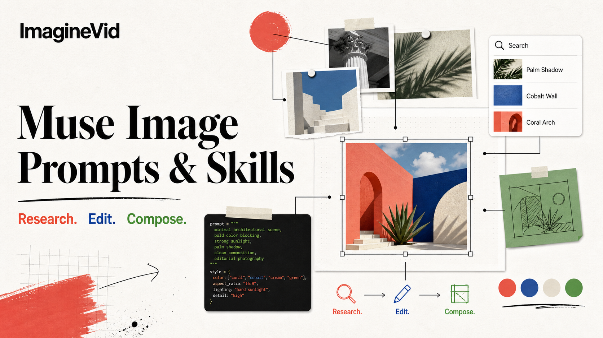

<a href="https://github.com/imagineVid/Awesome-muse-image-prompts-and-skills">
  
</a>

> Explore fluxos da ImagineVid para transformar prompts em visuais prontos para produção.
# Awesome Muse Image Prompts e Skills

[](https://github.com/sindresorhus/awesome)
[](https://github.com/imagineVid/Awesome-muse-image-prompts-and-skills)
[](https://creativecommons.org/licenses/by/4.0/)
[](https://github.com/imagineVid/Awesome-muse-image-prompts-and-skills/actions)
[](docs/CONTRIBUTING.md)

> Uma coleção da ImagineVid com prompts do Muse Image, skills reutilizáveis e exemplos visuais

> **Atribuição e remoção:** cada prompt liga à fonte pública e ao respetivo autor. Os direitos permanecem com os seus titulares. Abra uma issue para pedir correções ou remoções.

---

[](README.md) [](README_zh.md) [](README_ja-JP.md) [](README_ko-KR.md) [](README_es-ES.md) [](README_de-DE.md) [](README_fr-FR.md) [](README_it-IT.md) [](README_pt-PT.md) [](README_tr-TR.md)
[](README_ar-SA.md) [](README_ru-RU.md) [](README_nl-NL.md) [](README_pl-PL.md)

---

## Ver a coleção

**[Ver a coleção](https://imaginevid.io/pt/ai-image-generator)**

Porquê usar esta coleção?

Cada caso preserva a fonte e a autoria originais. Os links de criação abrem o ImagineVid e as capacidades baseiam-se em fontes primárias da Meta.

| Recurso | GitHub README | ImagineVid |
|---------|--------------|---------------------|
| Layout visual | Referência ordenada pela fonte | Exploração visual por categorias |
| Pesquisar | Pesquisa no repositório | Navegação editorial estruturada |
| Fluxo de prompts | - | Prompts reutilizáveis com variáveis |
| Móvel | Markdown nativo | Legível em todas as versões linguísticas |
| Categorias | - | Explorar por categoria |


### Explorar por categoria

- [**Pesquisa agêntica e visuais factuais**](#workflow-agentic-research-factual-visuals) - Prompts de pesquisa que integram factos atuais, cálculos ou estruturas geradas por código.
- [**Edição precisa e preservação da cena**](#workflow-precision-editing-scene-preservation) - Edições locais que alteram o alvo e preservam composição, luz, identidade e pormenores não afetados.
- [**Composição multirreferência e identidade**](#workflow-multi-reference-composition-identity) - Composições com várias referências que preservam pessoas, produtos, vestuário ou sistemas visuais reconhecíveis.
- [**Tipografia, cartazes e layouts estruturados**](#workflow-typography-posters-structured-layouts) - Visuais de design em que contam texto legível, hierarquia, espaçamento e regras de composição reutilizáveis.
- [**Arte sequencial e formatos sociais**](#workflow-sequential-art-social-formats) - Carrosséis, painéis, sequências narrativas e formatos sociais coerentes entre imagens.
- [**Retratos, textura e direção artística**](#workflow-portraits-texture-art-direction) - Prompts de retrato e direção artística guiados por semelhança, textura, luz e linguagem visual intencional.

---

## Índice

- [Ver a coleção](#ver-a-coleção)
- [O que é Muse Image?](#o-que-é-muse-image)
- [Casos oficiais de capacidade](#official-capability-cases)
- [Estatísticas](#estatísticas)
- [Community · Prompts em destaque](#community-featured-prompts)
- [Community · Todos os prompts](#community-prompt-cases)
- [Como contribuir](#como-contribuir)
- [Licença](#licença)
- [Agradecimentos](#agradecimentos)
- [Histórico de stars](#histórico-de-stars)

---

## O que é Muse Image?

**Muse Image** é o modelo agêntico da Meta para gerar e editar imagens, apresentado em julho de 2026. Pode usar ferramentas de pesquisa e código, dedicar mais computação durante a inferência para rever e melhorar o resultado, combinar várias referências e fazer alterações locais preservando o resto da cena. A Meta está a disponibilizá-lo gradualmente no Meta AI e em alguns produtos de consumo; a disponibilidade varia por produto e região.

A coleção separa demonstrações oficiais de casos da comunidade. Cada entrada mantém a fonte pública, o autor, o resultado visual e uma indicação transparente de como o prompt foi recuperado ou normalizado.

- **Entrada multimodal nativa** - Combine instruções de texto com uma ou mais imagens de referência no mesmo pedido
- **Geração e edição** - Crie imagens, aplique novo estilo a uma referência ou faça alterações específicas em linguagem natural
- **Deixe o modelo rever o próprio trabalho** - Ferramentas agênticas e autorrefinamento podem melhorar factos, composição e detalhe
- **Aperfeiçoamento conversacional** - Ajuste composição, sujeito, iluminação ou estilo sem reconstruir todo o briefing
- **Edite sem reconstruir o enquadramento** - Altere apenas a zona pretendida, preservando composição, identidade, luz e objetos não afetados
- **Confirme a disponibilidade por produto** - Muse Image está em implementação gradual e este repositório não pressupõe uma API pública

**Fontes da pesquisa:** [Meta AI engineering overview](https://ai.meta.com/blog/introducing-muse-image-muse-video-msl/) · [Meta product announcement](https://about.fb.com/news/2026/07/introducing-muse-image-meta-ai/) · [Create images on ImagineVid](https://imaginevid.io/pt/ai-image-generator)

### Reutilizar as variáveis do prompt

Alguns prompts de origem incluem variáveis entre parênteses retos, como `[BRAND]`, `[OBJECT]` ou `[NAME]`. Substitua apenas esses valores e mantenha a estrutura visual já testada.

**Exemplo:**
```
Substitua `[BRAND]` pela sua marca ou `[OBJECT]` pelo objeto pretendido, sem alterar composição, luz e materiais.
```

As variáveis tornam um prompt documentado reutilizável sem obrigar a reescrever todo o briefing.

---

<a id="official-capability-cases"></a>

## Casos oficiais de capacidade

> Exemplos de lançamento da Meta. Os títulos editoriais são localizados; os prompts oficiais mantêm-se em inglês para verificação.

<a id="official-agentic-tools"></a>

### Official Agentic Tool-Use Cases

Meta's launch examples showing Muse Image using code, search, and self-refinement before generating the final visual.

<a id="official-case-1"></a>

#### Caso 1: Scannable conference QR code in a manhwa scene


**Prompt oficial de origem (inglês):**

```
Create a 3:2 Korean manhwa-style conference scene with a young woman checking her phone beside an ICML 2025 poster. Generate and verify a scannable QR code for https://meta.ai, place it naturally on the poster, and keep the code readable after composition.
```

---

<a id="official-case-2"></a>

#### Caso 2: Swiss poster with coded Julia and Sierpinski fractals


**Prompt oficial de origem (inglês):**

```
Code a Julia set and an IFS Sierpinski triangle, render both accurately, then arrange them as a mid-century Swiss poster on warm off-white. Use an asymmetrical grid, generous white space, red, blue, and black geometric accents, and clean left-aligned labels.
```

---

<a id="official-case-3"></a>

#### Caso 3: Search-grounded moon-formation infographic


**Prompt oficial de origem (inglês):**

```
Research reputable sources on the giant-impact hypothesis, then create a vertical six-stage infographic covering proto-Earth, Theia, collision, debris disk, Moon formation, and present-day evidence. Use accurate labels, coherent cinematic space visuals, and concise evidence and counterpoint boxes.
```

---

<a id="official-case-4"></a>

#### Caso 4: Marketplace-grounded bedroom redesign


**Prompt oficial de origem (inglês):**

```
Using the uploaded bedroom and San Francisco location, redesign the room with warm, simple vintage pieces found through current Facebook Marketplace searches. Preserve the architecture and camera view; integrate a wood nightstand, dresser, rug, lamp, rattan chair, and autumn landscape art with realistic scale, light, and contact shadows.
```

---

<a id="official-precision-editing"></a>

### Official Precision Editing Cases

Short natural-language edits published by Meta, paired with the resulting Muse Image media.

<a id="official-case-5"></a>

#### Caso 5: Historical photo restoration

<table>
<tr>
<td width="50%" valign="top">

**Before:**


</td>
<td width="50%" valign="top">

**After:**


</td>
</tr>
</table>

**Prompt oficial de origem (inglês):**

```
Restore this image.
```

---

<a id="official-case-6"></a>

#### Caso 6: Fog removal with valley reveal

<table>
<tr>
<td width="50%" valign="top">

**Before:**


</td>
<td width="50%" valign="top">

**After:**


</td>
</tr>
</table>

**Prompt oficial de origem (inglês):**

```
Edit this to clear up the fog and reveal the beautiful valley below.
```

---

<a id="official-case-7"></a>

#### Caso 7: Rainbow-gradient flower edit

<table>
<tr>
<td width="50%" valign="top">

**Before:**


</td>
<td width="50%" valign="top">

**After:**


</td>
</tr>
</table>

**Prompt oficial de origem (inglês):**

```
Change the flower so the petals form a rainbow gradient.
```

---

<a id="official-case-8"></a>

#### Caso 8: Exact parking-sign text replacement

<table>
<tr>
<td width="50%" valign="top">

**Before:**


</td>
<td width="50%" valign="top">

**After:**


</td>
</tr>
</table>

**Prompt oficial de origem (inglês):**

```
Change this image to be '$3.00 ALL DAY', change the 'NO FREE PARKING' text to 'FREE PARKING ON WEEKENDS', and change the phone number to 555-5555.
```

---

<a id="official-case-9"></a>

#### Caso 9: Context-preserving zoom-out

<table>
<tr>
<td width="50%" valign="top">

**Before:**


</td>
<td width="50%" valign="top">

**After:**


</td>
</tr>
</table>

**Prompt oficial de origem (inglês):**

```
Zoom out slightly to show the chaos the dog has seen, giving context to its sheepish look.
```

---

<a id="official-multi-turn-composition"></a>

### Official Multi-Turn Composition Case

A scene carried across multiple edits while identity, environment, and an embedded reference remain coherent.

<a id="official-case-10"></a>

#### Caso 10: Cat-and-dog picnic becomes a complete cafe identity

<table>
<tr>
<td width="33%" valign="top">

**Picnic:**


</td>
<td width="33%" valign="top">

**Interior:**


</td>
<td width="33%" valign="top">

**Exterior:**


</td>
</tr>
</table>

**Prompt oficial de origem (inglês):**

```
Make an image of the referenced cat and dog as best friends having a picnic on a sunny day in vintage 35mm style. Then place that exact picnic image in a frame on a cozy cafe wall, and finally show the cafe exterior while keeping the framed photo visible through the window.
```

---

## Estatísticas

<div align="center">

| Métrica | Quantidade |
|--------|-------|
| Total de prompts | **13** |
| Destaque | **3** |
| Última atualização | **sexta-feira, 21 de agosto de 2026 às 12:36:29 UTC** |

</div>

---

<a id="community-featured-prompts"></a>

## Community · Prompts em destaque

> Escolhidos pela reutilização, clareza visual e variedade criativa

<a id="prompt-1"></a>

### No. 1: Fotografia noticiosa com preços atuais do mercado


#### Descrição

Imagem editorial factual que pesquisa preços locais e os apresenta em etiquetas de banca legíveis.

#### Prompt original (em inglês)

```
Create an ultra-realistic news photograph from Türkiye. Show a greengrocer standing behind a market stall filled with different fruits. Every fruit must have a clearly readable label with its Turkish name and price. Research current average fruit prices in Türkiye and use plausible up-to-date values. Keep the scene observational rather than staged: natural daylight, documentary framing, realistic skin and produce texture, accurate Turkish typography, and no invented brands.
```

#### Resultados da fonte

<table>
<tr>
<td width="100%" valign="top" align="center"></td>
</tr>
</table>

#### Detalhes

- **Autor:** [Ozan Sihay](https://x.com/ozansihay)
- **Fonte:** [Fonte](https://x.com/ozansihay/status/2074751589714133153)
- **Publicado:** 8 de julho de 2026
- **Idiomas:** tr

**[Usar este prompt · ImagineVid](https://imaginevid.io/pt/ai-image-generator)**

---

<a id="prompt-2"></a>

### No. 2: Transferência de personagem sem alterar a cena


#### Descrição

Substitui apenas a personagem-alvo, preservando plano, roupa, pose, oclusões, luz e textura fotográfica.

#### Prompt original (em inglês)

```
Use the scene image as the primary source of truth. Replace only the target character with the character from the attached reference sheet. Preserve the original composition, camera angle, lens, framing, background, props, set dressing, architecture, atmosphere, color grade, depth of field, film grain, aspect ratio, and cinematic still quality.

Preserve the reference character's face, likeness, hairstyle, hair texture and length, age, body proportions, build, exact outfit, footwear, accessories, layering, materials, colors, and patterns. Do not beautify, redesign, stylize, or reinterpret the identity. Match the original pose, scale, perspective, eye line, and interaction with the environment.

Match the scene lighting precisely: direction, softness, contrast, exposure, color temperature, shadow shape, rim light, bounce light, haze, practical sources, and reflections. Preserve foreground occlusions, contact shadows, floor contact, reflections, and environmental effects. Blend hands, feet, hair, clothing edges, and body contours naturally. Do not change any other person, object, background detail, camera position, or mood. The result must look like the replacement character was photographed in the original shot, not pasted into it.
```

#### Resultados da fonte

<table>
<tr>
<td width="25%" valign="top" align="center"></td>
<td width="25%" valign="top" align="center"></td>
<td width="25%" valign="top" align="center"></td>
<td width="25%" valign="top" align="center"></td>
</tr>
</table>

#### Detalhes

- **Autor:** [V](https://x.com/VictorInFocus)
- **Fonte:** [Fonte](https://x.com/VictorInFocus/status/2075689215510122714)
- **Publicado:** 10 de julho de 2026
- **Idiomas:** en

**[Usar este prompt · ImagineVid](https://imaginevid.io/pt/ai-image-generator)**

---

<a id="prompt-3"></a>

### No. 3: Carrossel panorâmico contínuo em quatro cartões


#### Descrição

Cria um único master e só depois o divide, mantendo perspetiva, luz, identidade e continuidade.

#### Prompt original (em inglês)

```
Act as a visual art director, continuity supervisor, image compositor, and production technician. Create one uninterrupted panoramic artwork for a four-card 9:16 social carousel. Do not generate four independent illustrations.

MASTER: 4320 × 1920 px, one camera, one lens, one horizon, one perspective system, one light direction, one atmosphere, one color grade, and one coherent world. Slice only after the master is final: Card 01 x=0–1079, Card 02 x=1080–2159, Card 03 x=2160–3239, Card 04 x=3240–4319. Export in that order at 1080 × 1920 px each.

COMPOSITION: create a left-to-right progression: hook, continuation, reveal, resolution. Carry at least one broad continuity element such as a road, garment, architecture, cloud bank, or light beam through multiple cards. Keep faces, eyes, hands, text, logos, and small focal objects at least 120 px away from internal seams. Never add gutters, borders, labels, duplicated objects, missing pixels, or overlap.

CONSISTENCY: preserve subject anatomy, identity, costume, materials, scale, shadows, contact points, and environmental depth. Use one intentional palette and motivated light source. Text is excluded unless explicitly supplied; if supplied, reproduce it exactly and keep it inside safe areas.

QUALITY CONTROL: reconstruct Cards 01–04 edge-to-edge with zero spacing. Inspect all seams for aligned horizon, perspective, architecture, fabric, hair, light, color, and texture. If any seam fails, repair the master and export all four cards again. Never patch a card independently.
```

#### Resultados da fonte

<table>
<tr>
<td width="25%" valign="top" align="center"></td>
<td width="25%" valign="top" align="center"></td>
<td width="25%" valign="top" align="center"></td>
<td width="25%" valign="top" align="center"></td>
</tr>
</table>

#### Detalhes

- **Autor:** [Emily](https://x.com/IamEmily2050)
- **Fonte:** [Fonte](https://x.com/IamEmily2050/status/2075734256316199185)
- **Publicado:** 11 de julho de 2026
- **Idiomas:** en

**[Usar este prompt · ImagineVid](https://imaginevid.io/pt/ai-image-generator)**

---

<a id="community-prompt-cases"></a>

## Community · Todos os prompts

> Twitter/X-sourced community prompt cases, ordenados por data de publicação e prioridade editorial.

<a id="workflow-agentic-research-factual-visuals"></a>

### Pesquisa agêntica e visuais factuais (1)

Prompts de pesquisa que integram factos atuais, cálculos ou estruturas geradas por código.

**Community · Prompts em destaque**

- [Fotografia noticiosa com preços atuais do mercado](#prompt-1)

<a id="workflow-precision-editing-scene-preservation"></a>

### Edição precisa e preservação da cena (2)

Edições locais que alteram o alvo e preservam composição, luz, identidade e pormenores não afetados.

<a id="prompt-5"></a>

#### No. 1: Sair do editor Unity


##### Descrição

Transforma a janela do software numa fronteira física e amplia apenas o vidro partido na segunda edição.

##### Prompt original (em inglês)

```
Using my uploaded portrait as the identity reference, generate an image of me stepping out of the Unity Editor's Scene view while holding a solid red 3D cube. The editor viewport should read clearly as a digital workspace behind me, while my front leg and torso cross into the real room. Preserve my face, clothing, and body proportions. Add convincing contact shadows and perspective where the screen boundary breaks.

Refinement: enlarge the shattered-glass effect around the point where I cross the viewport. Keep the face, pose, cube, editor UI, camera, and lighting unchanged; alter only the broken boundary and flying glass fragments.
```

##### Resultados da fonte

<table>
<tr>
<td width="50%" valign="top" align="center"></td>
<td width="50%" valign="top" align="center"></td>
</tr>
</table>

##### Detalhes

- **Autor:** [Dilmer](https://x.com/Dilmerv)
- **Fonte:** [Fonte](https://x.com/Dilmerv/status/2074632200394523110)
- **Publicado:** 7 de julho de 2026
- **Idiomas:** en

**[Usar este prompt · ImagineVid](https://imaginevid.io/pt/ai-image-generator)**

---

<a id="prompt-8"></a>

#### No. 2: Retrato de luxo hausa na hora dourada


##### Descrição

Preserva com rigor a identidade facial e articula traje tradicional, arquitetura moderna, automóvel de luxo e luz dourada natural.

##### Prompt original (em inglês)

```
Use the uploaded photo as the facial identity reference. Preserve the person's facial structure, skin tone, hairstyle, eyebrows, eyes, nose, lips, ears, age, proportions, and natural expression with maximum accuracy. Create a premium, ultra-realistic full-body portrait of the subject standing confidently outside a modern luxury home during golden hour. Dress him in a light-grey traditional Hausa kaftan made from high-quality fabric, with long sleeves, matching tailored trousers, subtle chest embroidery, a patterned Hausa cap, and slim transparent eyeglasses. He stands naturally with one hand in his pocket, looking slightly downward with a calm, thoughtful expression. Behind him, show a dark-grey contemporary mansion with large glass windows, warm wall lights, ornamental palms in black planters, and part of a glossy black luxury sedan. Use interlocking grey-and-black driveway stones, soft golden sunlight, realistic shadows, shallow depth of field, natural skin texture, crisp fabric folds, restrained HDR, and premium lifestyle-magazine composition. Full-frame camera, 85mm lens, f/2, ISO 100, eye-level vertical 4:5 framing. No facial drift, body distortion, extra limbs, text, watermark, or artificial beauty retouching.
```

##### Resultados da fonte

<table>
<tr>
<td width="100%" valign="top" align="center"></td>
</tr>
</table>

##### Detalhes

- **Autor:** [ABS](https://x.com/abs_uiux)
- **Fonte:** [Fonte](https://x.com/abs_uiux/status/2076737842399633676)
- **Publicado:** 13 de julho de 2026
- **Idiomas:** en

**[Usar este prompt · ImagineVid](https://imaginevid.io/pt/ai-image-generator)**

---

<a id="workflow-multi-reference-composition-identity"></a>

### Composição multirreferência e identidade (2)

Composições com várias referências que preservam pessoas, produtos, vestuário ou sistemas visuais reconhecíveis.

**Community · Prompts em destaque**

- [Transferência de personagem sem alterar a cena](#prompt-2)

<a id="prompt-13"></a>

#### No. 3: Direção de arte com várias referências e funções de imagem integradas


##### Descrição

Uma reconstrução transparente da publicação oficial da Meta sobre o Muse Image, testando funções intercaladas de texto e imagem para identidade, figurino, objetos, ambientes e estilo.

##### Prompt original (em inglês)

```
Create a polished editorial group portrait using inline reference images assigned by role: [person reference] supplies the subject’s identity and facial structure; [wardrobe reference] supplies the outfit; [object reference] supplies a hero prop; [environment reference] supplies the location; [style reference] supplies the color and material language. Preserve the subject’s identity, the prop’s shape, the wardrobe construction, and the environment’s spatial logic. Place each reference inline next to its instruction and keep every image’s role distinct. Compose one coherent scene with natural scale, plausible lighting, consistent perspective, readable negative space, and no accidental duplication. Do not merge reference subjects, replace the requested object, invent logos or text, or copy an unrelated layout.
```

##### Resultados da fonte

<table>
<tr>
<td width="100%" valign="top" align="center"></td>
</tr>
</table>

##### Detalhes

- **Autor:** [AI at Meta](https://x.com/AIatMeta)
- **Fonte:** [Fonte](https://x.com/AIatMeta/status/2074587874448625869)
- **Publicado:** 7 de julho de 2026
- **Idiomas:** en

**[Usar este prompt · ImagineVid](https://imaginevid.io/pt/ai-image-generator)**

---

<a id="workflow-typography-posters-structured-layouts"></a>

### Tipografia, cartazes e layouts estruturados (5)

Visuais de design em que contam texto legível, hierarquia, espaçamento e regras de composição reutilizáveis.

<a id="prompt-6"></a>

#### No. 4: Cartaz turco de ficção científica independente


##### Descrição

Teste compacto de conceito, composição vertical e título localizado legível.

##### Prompt original (em inglês)

```
Design a vertical poster for an independent science-fiction film set in Türkiye. Invent a short, memorable Turkish title and render it accurately. Build a distinctive cinematic concept rather than imitating an existing franchise. Use one strong central visual idea, controlled negative space, practical-looking photography, restrained production credits, and a coherent color grade. The title must remain the clearest text element.
```

##### Resultados da fonte

<table>
<tr>
<td width="100%" valign="top" align="center"></td>
</tr>
</table>

##### Detalhes

- **Autor:** [Ozan Sihay](https://x.com/ozansihay)
- **Fonte:** [Fonte](https://x.com/ozansihay/status/2074762671342186760)
- **Publicado:** 8 de julho de 2026
- **Idiomas:** tr

**[Usar este prompt · ImagineVid](https://imaginevid.io/pt/ai-image-generator)**

---

<a id="prompt-7"></a>

#### No. 5: Índice de criaturas dos números primos


##### Descrição

Atribui uma criatura distinta a cada primo de 2 a 47 para testar grelha, contagem e texto.

##### Prompt original (em inglês)

```
Create a clean illustrated index titled PRIME CREATURES. Include one original collectible creature for each prime number from 2 through 47: 2, 3, 5, 7, 11, 13, 17, 19, 23, 29, 31, 37, 41, 43, and 47. Arrange them in a disciplined grid. Each cell must contain exactly one creature, the correct prime number, and a short unique name. Make every silhouette and color identity distinct while keeping one consistent illustration system. Do not include composite numbers, duplicate creatures, missing primes, extra labels, or franchise characters.
```

##### Resultados da fonte

<table>
<tr>
<td width="100%" valign="top" align="center"></td>
</tr>
</table>

##### Detalhes

- **Autor:** [Max Woolf](https://x.com/minimaxir)
- **Fonte:** [Fonte](https://x.com/minimaxir/status/2074619946026586223)
- **Publicado:** 7 de julho de 2026
- **Idiomas:** en

**[Usar este prompt · ImagineVid](https://imaginevid.io/pt/ai-image-generator)**

---

<a id="prompt-9"></a>

#### No. 6: Luxury wedding-planner advertising poster


##### Descrição

A source-backed Muse Image layout case that tests readable typography, restrained romantic color, service icons, and print-ready hierarchy in one vertical poster.

##### Prompt original (em inglês)

```
Create a luxury advertising poster for a fictional wedding-planning studio. Modern minimal composition in blush pink, ivory, sage green, and restrained gold. Build a watercolor floral frame from roses, eucalyptus, pampas grass, and gold-leaf line art. At the top center, place a circular E&W monogram inside a botanical wreath. Set the exact headline “ELEGANT WEDDINGS, Perfectly Planned” in bold serif type and the exact subheadline “Your Dream Day, Our Expertise” in gold italic serif. Center a tasteful silhouette of a bride and groom holding hands, surrounded by soft watercolor flowers. Below, create four aligned service icons labeled Decoration, Catering, Photography, and Venue. Finish with a gold-bordered CTA box reading “Book Your Free Consultation Today” and fictional contact details. Professional print finish, vertical 4:5, readable typography, no garbled copy, no extra logos.
```

##### Resultados da fonte

<table>
<tr>
<td width="100%" valign="top" align="center"></td>
</tr>
</table>

##### Detalhes

- **Autor:** [Abkr Sadiq](https://x.com/abs_uiux)
- **Fonte:** [Fonte](https://x.com/abs_uiux/status/2078805002395492649)
- **Publicado:** 19 de julho de 2026
- **Idiomas:** en

**[Usar este prompt · ImagineVid](https://imaginevid.io/pt/ai-image-generator)**

---

<a id="prompt-10"></a>

#### No. 7: Novo caso: For Meta Muse image, remember it is still free


##### Descrição

Caso reutilizável baseado numa fonte pública do X, com direção visual clara e restrições verificáveis.

##### Prompt original (em inglês)

```
for Meta Muse image, remember it is still free so generate as much as you can, especially character sheet and Anime style image's.
```

##### Resultados da fonte

<table>
<tr>
<td width="25%" valign="top" align="center"></td>
<td width="25%" valign="top" align="center"></td>
<td width="25%" valign="top" align="center"></td>
<td width="25%" valign="top" align="center"></td>
</tr>
</table>

##### Detalhes

- **Autor:** [Emily](https://x.com/IamEmily2050)
- **Fonte:** [Fonte](https://x.com/IamEmily2050/status/2076860545756545044)
- **Publicado:** 14 de julho de 2026
- **Idiomas:** en

**[Usar este prompt · ImagineVid](https://imaginevid.io/pt/ai-image-generator)**

---

<a id="prompt-11"></a>

#### No. 8: New case: Neon visionary identity portrait


##### Descrição

Caso selecionado do X com objetivo visual claro, composicao controlavel, evidencia publica de midia e fonte rastreavel.

##### Prompt original (em inglês)

```
Create an ultra-realistic cinematic close-up portrait using the uploaded face as the exact identity reference. Preserve 100% of the person's facial structure, proportions, skin texture, wrinkles, eye shape, eyebrows, nose, lips, hairstyle, beard, expression, and all unique facial features. Depict the subject wearing modern oversized transparent-frame glasses, gazing upward with a thoughtful, visionary expression. Illuminate the scene with dramatic neon lighting in vibrant purple, magenta, and electric blue tones, casting soft gradients across the face and creating vivid reflections in the lenses. Use a clean minimalist gradient background with a futuristic atmosphere. Capture every skin pore, beard strand, and hair texture with exceptional realism. Soft cinematic lighting, HDR, volumetric glow, ultra-detailed facial features, subtle film grain, shallow depth of field, shot on a full-frame camera with an 85mm f/1.4 lens, razor-sharp focus on the eyes, 8K resolution, premium luxury editorial, futuristic technology aesthetic, Apple-style commercial photography, masterpiece quality.
```

##### Resultados da fonte

<table>
<tr>
<td width="100%" valign="top" align="center"></td>
</tr>
</table>

##### Detalhes

- **Autor:** [Hatman 🎩](https://x.com/hatman)
- **Fonte:** [Fonte](https://x.com/hatman/status/2075082522069782732)
- **Publicado:** 9 de julho de 2026
- **Idiomas:** en

**[Usar este prompt · ImagineVid](https://imaginevid.io/pt/ai-image-generator)**

---

<a id="workflow-sequential-art-social-formats"></a>

### Arte sequencial e formatos sociais (1)

Carrosséis, painéis, sequências narrativas e formatos sociais coerentes entre imagens.

**Community · Prompts em destaque**

- [Carrossel panorâmico contínuo em quatro cartões](#prompt-3)

<a id="workflow-portraits-texture-art-direction"></a>

### Retratos, textura e direção artística (2)

Prompts de retrato e direção artística guiados por semelhança, textura, luz e linguagem visual intencional.

<a id="prompt-4"></a>

#### No. 9: Retrato em poltrona inspirado nos mestres antigos


##### Descrição

Retrato editorial contido com couro gasto, reboco azul-petróleo, luz lateral e gradação cinematográfica.

##### Prompt original (em inglês)

```
A young woman reclines in an oversized vintage wingback armchair of deep chestnut leather, arranged with languid elegance in a painterly composition that echoes Old Master portraiture. She wears a pale cream silk dress with a muted dusty-rose and sage floral pattern. Her dark hair is swept back from a pale angular face; dark red lips and an unflinching gaze face the viewer. The worn leather glows along brass-studded seams and rolled arms.

Behind her, mottled teal and deep-blue plaster suggests age and quiet grandeur. Soft directional light falls from the left, shaping her arm and the folds of the dress while the right side falls into gentle shadow. Use a restrained complementary warm-and-cool palette, fine-art photography, cinematic color grading, rich tactile texture, and a timeless contemplative mood.
```

##### Resultados da fonte

<table>
<tr>
<td width="100%" valign="top" align="center"></td>
</tr>
</table>

##### Detalhes

- **Autor:** [Chain Loader](https://x.com/Chain_Loader)
- **Fonte:** [Fonte](https://x.com/Chain_Loader/status/2076324392183943418)
- **Publicado:** 12 de julho de 2026
- **Idiomas:** en

**[Usar este prompt · ImagineVid](https://imaginevid.io/pt/ai-image-generator)**

---

<a id="prompt-12"></a>

#### No. 10: Teste de tipografia turca sob a chuva


##### Descrição

Um caso baseado em fontes que explora “Teste de tipografia turca sob a chuva”, com instruções reutilizáveis e mídia de resultado verificável.

##### Prompt original (em inglês)

```
Create an ultra-photorealistic documentary street photograph of a person standing on a crowded city street during heavy rain, holding a small white note directly toward the camera. The note must be sharp, fully visible, and contain exactly this Turkish text: “Bu yapay zekâ testi; Türkçe metin doğruluğunu, el yazısını, insan ve el anatomisini, fotogerçekçiliği, yağmurlu hava koşullarını, kalabalık sokak detaylarını ve doğal ışığın gerçekçi yansımasını değerlendirmek için hazırlanmıştır: ç, ğ, ı, İ, ö, ş, ü.” Rain-soaked pavement with physically accurate reflections, realistic raindrops and wet clothing, pedestrians with umbrellas softly blurred in the background, natural grey overcast daylight, subtle reflections from storefronts and streetlights, authentic skin texture, anatomically correct hands and fingers, shallow depth of field, professional full-frame camera photograph, cinematic documentary realism, extremely detailed, ultra realistic. Aspect ratio 3:4.
```

##### Resultados da fonte

<table>
<tr>
<td width="25%" valign="top" align="center"></td>
<td width="25%" valign="top" align="center"></td>
<td width="25%" valign="top" align="center"></td>
<td width="25%" valign="top" align="center"></td>
</tr>
</table>

##### Detalhes

- **Autor:** [Ozan Sihay](https://x.com/ozansihay)
- **Fonte:** [Fonte](https://x.com/ozansihay/status/2080218385607008613)
- **Publicado:** 23 de julho de 2026
- **Idiomas:** en

**[Usar este prompt · ImagineVid](https://imaginevid.io/pt/ai-image-generator)**

---

## Como contribuir

Encontrou um workflow Muse Image bem documentado? Envie o prompt original, o resultado, o autor e a fonte através de GitHub Issues.

### GitHub Issue

1. [**Enviar um novo prompt**](https://github.com/imagineVid/Awesome-muse-image-prompts-and-skills/issues/new?template=submit-prompt.yml)
2. Preencha o formulário com o prompt, imagens e dados da fonte
3. Envie a proposta e aguarde a revisão do maintainer
4. Depois de aprovada, a issue pode ser sincronizada com os dados locais
5. O prompt aparecerá após a geração seguinte dos README

**Nota:** Cada proposta é verificada quanto à origem, prova do modelo, utilidade e duplicados antes da publicação.

Consulte [CONTRIBUTING.md](docs/CONTRIBUTING.md) para conhecer todas as regras.

---

## Licença

Disponibilizado sob a licença [CC BY 4.0](https://creativecommons.org/licenses/by/4.0/).

---

## Agradecimentos

<details>
<summary>Autores da comunidade (9)</summary>

[Abkr Sadiq](https://x.com/abs_uiux) · [AI at Meta](https://x.com/AIatMeta) · [Chain Loader](https://x.com/Chain_Loader) · [Dilmer](https://x.com/Dilmerv) · [Emily](https://x.com/IamEmily2050) · [Hatman 🎩](https://x.com/hatman) · [Max Woolf](https://x.com/minimaxir) · [Ozan Sihay](https://x.com/ozansihay)<br>
[V](https://x.com/VictorInFocus)

</details>

---

## Histórico de stars

[](https://github.com/imagineVid/Awesome-muse-image-prompts-and-skills/stargazers)

**[Histórico de stars](https://star-history.com/#imagineVid/Awesome-muse-image-prompts-and-skills&Date)**

---

<div align="center">

**[Ver a coleção](https://imaginevid.io/pt/ai-image-generator)** •
**[Enviar prompt](https://github.com/imagineVid/Awesome-muse-image-prompts-and-skills/issues/new?template=submit-prompt.yml)** •
**[Adicionar uma Star ao repositório](https://github.com/imagineVid/Awesome-muse-image-prompts-and-skills)**

<sub>README gerado automaticamente. Última atualização: 2026-08-21T12:36:29.324Z</sub>

</div>
